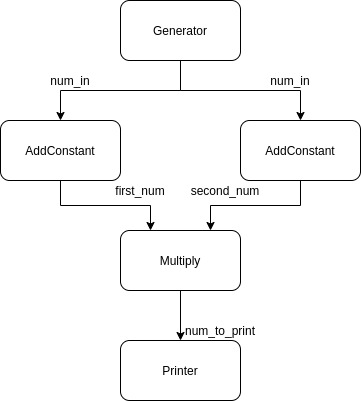

# Getting Started

## A simple example

We will build a graph with the following topology.



The corresponding code to build that graph would be:
```jldoctest
using Tissue

mutable struct SourceCalculator 
    count::Int64
    SourceCalculator() = new(0)
end

function Tissue.process(c::SourceCalculator)
    c.count += 1
    if c.count > 5
        # Indicates that the data stream is closed.
        # This is the last time that the function will be called
        return nothing
    end

    return c.count
end

struct AddConstantCalculator
    constant::Int
end

function Tissue.process(c::AddConstantCalculator, num_in::Int)::Int
    return num_in + c.constant
end

struct MultiplyCalculator end

function Tissue.process(c::MultiplyCalculator, first_num::Int, second_num::Int)::Int
    return first_num * second_num
end

struct PrinterCalculator end

function Tissue.process(c::PrinterCalculator, num_to_print)
    println(num_to_print)
end

@graph NumberGraph begin
    # 1. Declare calculators.
    @calculator source  = SourceCalculator()
    @calculator add0    = AddConstantCalculator(0)
    @calculator add42   = AddConstantCalculator(42)
    @calculator mult    = MultiplyCalculator()
    @calculator printer = PrinterCalculator()

    # 2. Declare the streams which connect the calculators together
    @bindstreams add0 (num_in = source)
    @bindstreams add42 (num_in = source)
    @bindstreams mult (first_num = add0) (second_num = add42)
    @bindstreams printer (num_to_print = mult)
end

graph = NumberGraph()
start(graph)
wait_until_done(graph)

# output
43
88
135
184
235
```
Feel free to run the code yourself. Remember that in Julia, you control the number of threads that get spawned when you run the program. See the `--threads` [command line option](https://docs.julialang.org/en/v1/manual/command-line-options/#command-line-options). To run the program with as many threads as your computer has CPUs, use

```shell
$ julia -t auto my_program.jl
```

Alright, back to the example. There's a lot going on here, so let's parse through this example one bit at a time.

```julia
using Tissue
```
This brings the functions and macros we are going to need into scope: 

+ `start()` launches all the calculators, each in its own task, and starts pulling data from the *source* calculator
+ `wait_until_done()` blocks the main thread until the source stops generating data, and all calculators are done processing.
+ `@graph` defines a graph, concretely a `struct NumberGraph`, with a topology as described in the `begin ... end` block.
+ `@calculator` declares a new node in the graph corresponding to a calculator object of any type.
+ `@bindstreams` declares the edges in the graph. To define an edge, one specifies the output of a calculator with a named input stream of another calculator.

```julia
mutable struct SourceCalculator 
    count::Int64
    SourceCalculator() = new(0)
end
```
This defines a calculator type which we will use to instantiate our *source* calculator. The source calculator is the one and only node in the graph which has no input streams. It is equally an error to instantiate more than one, or none at all. As you can see, there's nothing special about the type. More on the source calculator when we get to the graph definition.

```julia
function Tissue.process(c::SourceCalculator)
    c.count += 1
    if c.count > 5
        # Indicates that the data stream is closed.
        # This is the last time that the function will be called
        return nothing
    end

    return c.count
end
```
This is the crux of it all. We specify how a calculator of type `X` goes from input to output by adding a method to the `Tissue.process()` function; that is, the `process()` function that lives in the `Tissue` module. The convention is that the first argument to the function needs to be of type `X`, and the rest of the arguments define the streams which the calculator accepts. In this case, there are no streams, because we intend to use this calculator as our source calculator.

Note that more than one `Tissue.process(c::X, ...)` can be implemented. This is how you let the same calculator accept different streams, depending on the graph it is to be used in.


```julia
struct AddConstantCalculator
    constant::Int
end

function Tissue.process(c::AddConstantCalculator, num_in::Int)::Int
    return num_in + c.constant
end
```
We define a new calculator type called `AddConstantCalculator`. There is one difference with the source calculator though: its `process()` method accepts one stream named `num_in`. This is key. The name of the arguments in a `process()` method matter. They name a stream that will later be used when defining the graph topology with the `@graph` and `@bindstreams` macros. More on this later.

Here, we specified the type of the stream and the return type of `process()` for documentation purposes; they are by no means required.

```julia
struct MultiplyCalculator end

function Tissue.process(c::MultiplyCalculator, first_num::Int, second_num::Int)::Int
    return first_num * second_num
end
```
We define a new calculator type called `MultiplyCalculator`, as well as a `process()` which now takes 2 stream arguments. This is interesting. Remember that all calculators in the graph run concurrently. Then, both values are going to arrive at this calculator at different points in time. As a result, Tissue.jl buffers the data until at least one packet per stream has arrived, after which it calls this `process()` method. This complexity taken care for you is one of the perks of Tissue.jl.

```julia
struct PrinterCalculator end

function Tissue.process(c::PrinterCalculator, num_to_print)
    println(num_to_print)
end
```
Come to our final calculator type, `PrinterCalculator`. Nothing new here, except to show that really, all computation, including I/O calls, happens within calculators.

```julia
@graph NumberGraph begin
```
Finally, we get to the graph definition. The `@graph` macro takes 2 arguments: The name of the type, `NumberGraph`, and a code block in which we use `@calculator` and `@bindstreams` to define the topology; that is, the nodes and edges of the graph.

```julia
    # 1. Declare calculators.
    @calculator source  = SourceCalculator()
```
This defines a new calculator object of type `SourceCalculator`, and `source` is the variable that refers to it. This looks like and is a simple variable assignment as you know it, using the `SourceCalculator` struct constructor that you defined. The default one in this case.

```julia
    @calculator add0    = AddConstantCalculator(0)
    @calculator add42   = AddConstantCalculator(42)
    @calculator mult    = MultiplyCalculator()
    @calculator printer = PrinterCalculator()
```
Similarly, this defines four new calculator objects. Note that `add0` and `add42` are two calculators of the same type.

```julia
    # 2. Declare the streams which connect the calculators together
    @bindstreams add0 (num_in = source)
```
We get to our first `@bindstreams` declaration. The purpose of `@bindstreams` is to encode, for each calculator in our graph, where the data comes from for each stream. Here, the `add0`'s input stream called `num_in` will have its data come from the output stream of `source`. The parentheses around `num_in = source` are optional; we add them for clarity. Visually, this adds an edge in the graph from `source` to `add0`. As a reminder, we declared the stream `num_in` when we defined the `process(c::AddConstantCalculator, num_in::Int)` method.

```julia
    @bindstreams add42 (num_in = source)
```
This declaration is analogous to the previous one.

```julia
    @bindstreams mult (first_num = add0) (second_num = add42)
```
The `process()` method that we defined for the `MultiplyCalculator` defines two streams: `first_num` and `second_num`. Therefore, the `@bindstreams` declaration must bind the output of a calculator to each of them. By now, you probably figured out what this does: it takes the output of `add0` and sends it in `mult`'s `first_num` stream, and similarly for `add42` in the `second_num` stream.

```julia
    @bindstreams printer (num_to_print = mult)
end
```
This is the final `@bindstreams` declaration, which completes the graph definition! We defined all of our calculators and how they interact. Note that we didn't bind any stream to `source`, which tells `Tissue.jl` that this is the calculator we intend to use as our *source* calculator.

```julia
graph = NumberGraph()
```
We now get to actually use our graph! The `@graph` macro created a `struct NumberGraph` with a default constructor. We thus instantiate a new graph simply by creating an object of type `NumberGraph`.

```julia
start(graph)
```
This call starts every calculator in its own task and starts pulling data from the *source* calculator. It returns immediately.

```julia
wait_until_done(graph)
```
Finally, this blocks the main thread until the graph is done. In our case, this happens when our *source* returns `nothing`, indicating that it is done generating data. `wait_until_done` will wait until all the calculators are finished processing the last packet, cleanup and return.

That's all folks! Now, there's a thing or two we omitted in this example, so if you're hungry for more, follow me on to a more complicated example.

## A more useful example
Let's look at a more realistic example. We will write a graph which reads from the camera, runs a face detector on the image, and renders a box around the detected faces. At any time, the user can select the video feed window on their desktop and press any key to stop the graph. We will convert [this example from OpenCV](https://github.com/opencv/opencv_contrib/blob/master/modules/julia/samples/face_detect_dnn.jl) into a Tissue.jl graph.

```julia
using Tissue
using OpenCV
cv = OpenCV

struct CameraCalculator
    cap::cv.VideoCaptureAllocated

    function CameraCalculator()
        cap = cv.VideoCapture(Int32(0))
        new(cap)
    end
end

function Tissue.process(calc::CameraCalculator)
    ok, img = cv.read(calc.cap)
    ok ? img : nothing
end

function Tissue.close(calc::CameraCalculator)
    cv.release(calc.cap)
end

struct FaceDetectionCalculator
    net

    function FaceDetectionCalculator()
        net = cv.dnn_DetectionModel(
            "assets/opencv_face_detector.pbtxt",
            "assets/opencv_face_detector_uint8.pb",
        )
        size0 = Int32(300)
        cv.dnn.setInputMean(net, (104, 177, 123))
        cv.dnn.setInputScale(net, 1.0)
        cv.dnn.setInputSize(net, size0, size0)

        new(net)
    end
end

function Tissue.process(calc::FaceDetectionCalculator, in_frame)
    classIds, confidences, boxes =
        cv.dnn.detect(calc.net, in_frame, confThreshold = Float32(0.5))

    (confidences, boxes)
end

struct FaceRendererCalculator end

function Tissue.process(calc::FaceRendererCalculator, in_frame, confidences_and_boxes)
    confidences, boxes = confidences_and_boxes

    out_frame = deepcopy(in_frame)

    for i in 1:size(boxes,1)
        confidence = confidences[i]
        x0 = Int32(boxes[i].x)
        y0 = Int32(boxes[i].y)
        x1 = Int32(boxes[i].x+boxes[i].width)
        y1 = Int32(boxes[i].y+boxes[i].height)
        cv.rectangle(out_frame, cv.Point{Int32}(x0, y0), cv.Point{Int32}(x1, y1), (100, 255, 100); thickness = Int32(5))
        label = "face: " * string(confidence)
        lsize, bl = cv.getTextSize(label, cv.FONT_HERSHEY_SIMPLEX, 0.5, Int32(1))
        cv.rectangle(out_frame, cv.Point{Int32}(x0,y0), cv.Point{Int32}(x0+lsize.width, y0+lsize.height+bl), (100,255,100); thickness = Int32(-1))
        cv.putText(out_frame, label, cv.Point{Int32}(x0, y0 + lsize.height),
        cv.FONT_HERSHEY_SIMPLEX, 0.5, (0, 0, 0); thickness = Int32(1), lineType = cv.LINE_AA)
    end

    out_frame
end

struct ImageDisplayCalculator end

function Tissue.process(calc::ImageDisplayCalculator, rendered_frame; graph::Graph)
    cv.imshow("detections", rendered_frame)

    if cv.waitKey(Int32(1)) >= 0
        stop(graph)
    end
end

@graph FaceGraph begin
    @calculator source = CameraCalculator()
    @calculator face_detector = FaceDetectionCalculator()
    @calculator renderer = FaceRendererCalculator()
    @calculator displayer = ImageDisplayCalculator()

    @bindstreams face_detector (in_frame = source)
    @bindstreams renderer (in_frame = source) (confidences_and_boxes = face_detector)
    @bindstreams displayer (rendered_frame = renderer)
end

function main()
    graph = FaceGraph()
    start(graph)
    wait_until_done(graph)
    println("Thanks for listening!")
end

main()
```
You can actually run this yourself! Just make sure you install the `OpenCV` package first (simply type `add OpenCV` on julia's `pkg` REPL).

We will focus on the bits that were not covered in the [previous example](#A-simple-example).

```julia
function Tissue.close(calc::CameraCalculator)
    cv.release(calc.cap)
end
```
To clean up resources acquired in a calculator constructor when the graph stops, implement `Tissue.close(::CalculatorType)` with the corresponding calculator type. It will be called in [`wait_until_done(graph)`](@ref) after all the calculators are done running.

```julia
function Tissue.process(calc::FaceRendererCalculator, in_frame, confidences_and_boxes)
    confidences, boxes = confidences_and_boxes

    out_frame = deepcopy(in_frame)

    for i in 1:size(boxes,1)
        ...
    end

    out_frame
end
```
The `process()` method for the `FaceRendererCalculator` highlights an important fact: data coming from the input streams could be accessed by multiple threads simultaneously since calculators run in their own [`task`](https://docs.julialang.org/en/v1/base/parallel/#Tasks). Therefore, we treat the data coming from input streams as immutable. Since we want to mutate it here, we first make a [`deepcopy`](https://docs.julialang.org/en/v1/base/base/#Base.deepcopy).

```julia
function Tissue.process(calc::ImageDisplayCalculator, rendered_frame; graph::Graph)
    cv.imshow("detections", rendered_frame)

    if cv.waitKey(Int32(1)) >= 0
        stop(graph)
    end
end
```
Finally, the `process()` method for `ImageDisplayCalculator` introduces two new concepts. First, a reference to the current graph object can be obtained by adding a `graph` keyword argument to the `process()` method. In this case, we need it to call [`Tissue.stop(graph)`](@ref), the second new concept. [`Tissue.stop(graph)`](@ref) does as the name suggests: it stops the graph. This means a few things: the *source* calculator stops being called for new data packets, all packets that were generated are allowed to be processed by all calculators. After no more packets remain in the graph, if the main thread is blocked on a call to [`Tissue.wait_until_done(graph)`](@ref), [`Tissue.close(calculator)`](@ref) is called on every calculator. Although there is no race condition here: if the main thread calls [`Tissue.wait_until_done(graph)`](@ref) only after all calculators are done, [`Tissue.close(calculator)`](@ref) is also called on all calculators.

And that's pretty much it! You should be good to go build awesome graphs now.
